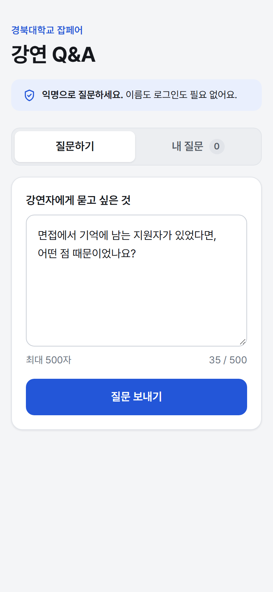
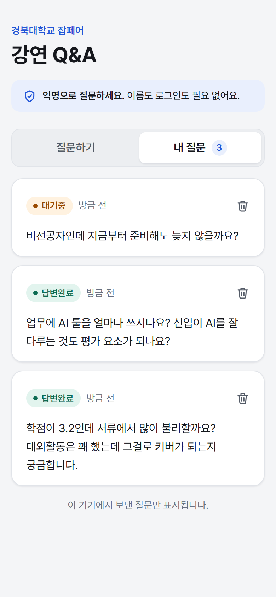
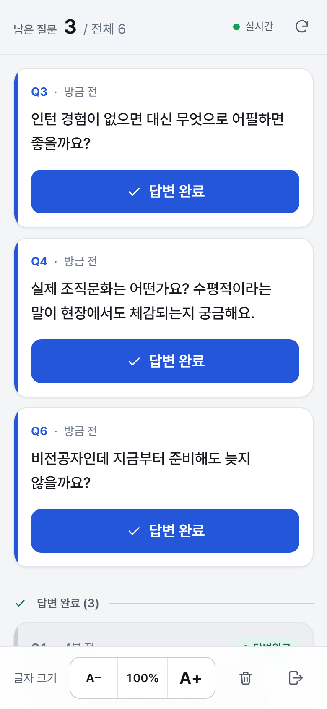
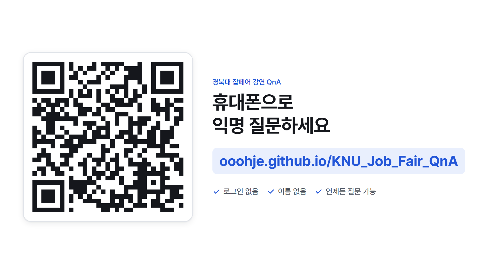

# 경북대 잡페어 강연 — 익명 Q&A

강연 중 청중이 QR로 접속해 **익명으로 질문**하고, 강연자는 휴대폰으로 질문을 보며
**답변 완료를 누르면 그 카드가 아래로 내려가는** 웹앱입니다.

빌드 도구 없는 정적 사이트 + Supabase. GitHub Pages에 그대로 올라갑니다.

## 화면 미리보기

실제 배포된 사이트를 캡처한 것입니다.

| 청중 · 질문하기 | 청중 · 내 질문 | 강연자 · 질문 리스트 |
|---|---|---|
|  |  |  |
| 로그인 없이 바로 작성 | 상태 배지와 삭제 버튼 | 미답변 위 · 답변완료 아래 |

프로젝터 투사용 QR 화면



## 화면

| 파일 | 용도 |
|---|---|
| `index.html` | 청중용 — 질문 작성, 내 질문 보기·삭제 |
| `admin/index.html` | 강연자용 — 비밀 코드 입장, 질문 리스트, 답변 완료 토글, 글자 크기 조절, 전체 초기화 |
| `qr.html` | 프로젝터/PPT 투사용 — 접속 QR + URL 크게 |

## 구조

```
index.html / admin/index.html / qr.html   화면
styles.css                           디자인 토큰 + 컴포넌트 (공용)
ui.js                                토스트, 아이콘, 상대시간, FLIP 애니메이션
db.js                                Supabase 데이터 레이어 (window.QnaDB)
config.js                            Supabase URL / anon key / 접속 주소
supabase/schema.sql                  테이블 · RLS · RPC 함수 · Realtime
supabase/set-passphrase.sql           강연자 비밀 코드 설정
```

## 설정

1. **Supabase** — [SUPABASE_SETUP.md](SUPABASE_SETUP.md) 대로 `schema.sql` 실행 →
   `set-passphrase.sql` 로 비밀 코드 설정
2. **`config.js`** — `SUPABASE_ANON_KEY` 에 anon public key 붙여넣기,
   `PUBLIC_URL` 을 실제 배포 주소로 맞추기 (QR이 이 주소를 가리킵니다)
3. **GitHub Pages** — 저장소 Settings → Pages → Source: `Deploy from a branch`,
   Branch: `main` / `/ (root)` → Save

배포 후 주소

- 청중: `https://ooohje.github.io/KNU_Job_Fair_QnA/`
- 강연자: `https://ooohje.github.io/KNU_Job_Fair_QnA/admin`
- QR 투사: `https://ooohje.github.io/KNU_Job_Fair_QnA/qr.html`

## 강연 당일 순서

1. 리허설 데이터가 있으면 강연자 화면 하단 **휴지통 버튼**으로 전체 초기화
2. PPT에 `qr.html` 을 띄우거나 QR 이미지를 캡처해 슬라이드에 넣기
3. 내 휴대폰에서 `/admin` 접속 → 비밀 코드 입력 (한 번 입력하면 저장됨)
4. 질문이 들어오면 실시간으로 올라옴. 답변한 질문은 **답변 완료** → 아래로 내려감
5. 무대에서 안 보이면 하단 **A+** 로 글자 크기 키우기

## 로컬에서 확인

```bash
python -m http.server 4173
```

`http://localhost:4173` — 파일 프로토콜(`file://`)로 열면 익명 토큰 해시 계산
(`crypto.subtle`)이 동작하지 않으므로 반드시 http 로 띄우세요.

## 보안 / 익명성

- 청중은 로그인이 없고, 서버에는 이름·IP 대신 기기 랜덤 토큰의 **SHA-256 해시**만 저장
- 질문 삭제에는 해시가 아닌 **원본 토큰**이 필요 → 남의 질문은 지울 수 없음
- 답변 완료 표시·전체 삭제는 **강연자 비밀 코드**(bcrypt, DB에서만 검증) 필요
- RLS는 SELECT만 허용하고 쓰기는 모두 `SECURITY DEFINER` 함수로만 처리
- 도배 방지: 기기당 10초 쿨다운, 최대 20개
- `config.js` 의 anon key는 공개용이라 저장소에 올라가도 됩니다.
  **`service_role` 키는 절대 넣지 마세요.**

## UI

디자인은 Claude Design 캔버스에서 만든 시안을 그대로 구현했습니다
(`styles.css` 는 시안의 스타일시트 원본). 토큰은 `:root` 에만 정의되어 있고
다크 모드는 `prefers-color-scheme` 로 대응합니다.
